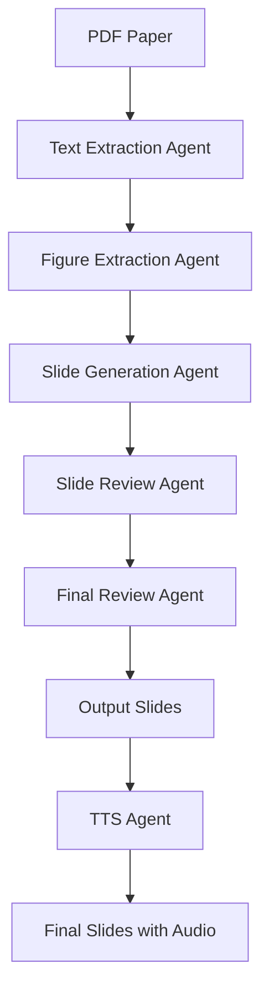

# Academic Paper to Slides

Transform academic papers into engaging presentation slides with AI assistance. This tool uses a multi-agent system to extract content, analyze key points, process figures, and generate polished slides with speaker notes and TTS integration.

## Agent Workflow



### 1. Text Extraction Agent
- **Responsibilities**:
  - PDF parsing with self-correction
  - Metadata validation
  - Section boundary detection

### 2. Figure Extraction Agent (VLM-powered)
- **Processing Pipeline**:
  1. Extract figures with captions
  2. VLM analysis (Claude 3.5) to generate a description of the figure

### 3. Slide Generation Agent (LLM-powered)
- Combine output from Figure Agent and the original paper text to create slides for each section
- Select appropriate layout for each slide

### 4. Slide Review Agent (LLM-powered)
- Review each slide one by one with the original paper as context.
- **Quality Checks**:
  - Technical accuracy vs original paper
  - Slide timing estimates
  - Visual consistency
  - Narrative flow
- **Auto-fix Capabilities**:
  - Bullet point condensation
  - Figure repositioning
  - Transition optimization

### 5. Final Review Agent (LLM-powered)
- Review the entire presentation as a whole.
- **Checks**:
  - Academic integrity
  - Disclosure requirements
  - Citation completeness
  - Accessibility compliance
  - Speaker note utility

### 6. TTS Agent
- Use OpenAI TTS to generate audio for the speaker notes of each slide.
- Insert the audio into the slide deck.

## Components

### 1. PDF Parser Module
- Extracts:
  - Metadata (title, authors, affiliations, venue)
  - Text content with section headers
  - Figures and captions
  - References/citations
- Tools: PyMuPDF, pdfplumber
- Output: Structured JSON with text blocks and figure locations

### 2. Content Analysis Pipeline
- **Layout Analyzer** (VLM):
  - Identifies paper sections using visual layout analysis
  - Classifies content types (equations, algorithms, proofs)
- **Key Point Extractor** (LLM):
  - GPT-4-turbo for section summarization
  - Extract 3-5 bullet points per section
  - Identify technical novelties
- **Flow Organizer** (LLM):
  - Creates narrative flow for presentation
  - Determines slide transitions and hierarchy

### 3. Figure Processing System
- **Figure Extractor**:
  - Direct image extraction from PDF
  - SVG recreation for vector graphics
- **Figure Explainer** (VLM):
  - Claude 3.5 Sonnet for:
  - Caption generation
  - Key element annotation
  - Simplified explanation
- **Figure Optimizer**:
  - Resolution enhancement
  - Accessibility features (alt-text)

### 4. Slide Generation Workflow
- **Slide Structure**:
  1. Title Slide
  2. One-Pager Summary
  3. Background & Motivation
  4. Technical Approach
  5. Key Results
  6. Impact & Limitations
  7. Recap Slide
- **Slidev Features**:
  - Two-column layouts
  - Image-right formatting
  - Progressive transitions
  - TTS-ready speaker notes with:
    - Complete spoken content
    - Pacing markers
    - Emphasis points
    - Pronunciation guides
  - Audio control components
  - Auto-play configuration

### 5. Academic Style Enforcer
- Formatting rules:
  - Consistent citation style
  - Equation numbering preservation
  - Algorithm pseudocode formatting
  - Disclosure of limitations
- Length controller:
  - 15-20 slides total
  - 1 minute per slide

### 6. TTS Integration System
- **Components**:
  1. OpenAI TTS API client
  2. Audio file storage
  3. Slidev audio component
- **Workflow**:
  ```mermaid
  sequenceDiagram
    Slide Agent->>TTS Service: Speaker notes text
    TTS Service->>Slide Agent: Audio URL
    Slide Agent->>Slidev Template: Embed audio component
  ```
- **Voice Settings**:
  - Voice: alloy/shimmer/nova
  - Speed: ±20% based on pacing markers
  - Pitch: Natural academic tone

## Output Example

```markdown
---
theme: seriph
background: https://cover.sli.dev
title: "Efficient Attention Mechanisms for Long Sequences"
# apply unocss classes to the current slide
class: text-center
# https://sli.dev/features/drawing
drawings:
  persist: false
# slide transition: https://sli.dev/guide/animations.html#slide-transitions
transition: slide-left
# enable MDC Syntax: https://sli.dev/features/mdc
mdc: true
---

---
layout: center
class: text-center
---

# Paper Title

<div class="text-xl mt-4">
  Author 1 · Author 2
  <span class="text-base opacity-75">Affiliation 1 · Affiliation 2</span>
</div>

<div class="text-sm mt-6">
  Conference Name · Date
</div>

<div class="absolute bottom-10 right-6 text-xs opacity-50">
  Slide content automatically generated from paper
</div>

---
transition: fade-out
---

<div grid="~ cols-2 gap-4">
# One-Pager Summary of TQDN (paper short name)

- **Core Innovation**: 
  Novel attention mechanism reducing O(n²) complexity
  - 40% faster training
  - 92% accuracy retention

- **Key Results**:
  - SOTA on GLUE benchmark
  - Efficient memory usage
  - Better long-context handling

- **Key Contribution**  
  Sparse attention pattern reducing O(n²) to O(n log n)
  - 45% faster training vs baseline
  - 98% accuracy retention
  
- **Applications**  
  Long-document NLP • Genome sequencing • Time-series analysis


</div>

<!--
SPEAKER: [pause=500] Let's start with our core innovation. [emphasis] We developed a sparse attention pattern that reduces time complexity from O(n²) to O(n log n). [speed=slow] This enables 45% faster training compared to previous approaches, while maintaining 98% accuracy. [pause=1000] The applications are particularly exciting - this work impacts long-document NLP analysis, genome sequencing pipelines, and large-scale time-series forecasting. [image-hint:attention-pattern] As shown in the diagram, our method selectively preserves critical attention paths while pruning redundant connections.
-->

---
transition: slide-up
layout: image-right
image: /figures/model-architecture.png
---

# Technical Approach

1. **Sparse Tree Construction**  
   - Hierarchical clustering of tokens
   - Dynamic pruning of irrelevant edges

2. **Gradient-aware Sparsification**  
   ```python
   def sparsify(attention_scores):
       threshold = quantile(attention_scores, 0.9)
       return attention_scores * (attention_scores > threshold)
   ```

3. **Hardware Optimization**  
   - Kernel fusion for sparse operations
   - Memory-efficient backpropagation

---
transition: slide-up
---

# Evaluation Results

<div grid="~ cols-2 gap-8">

<div>

**Speed Comparison**  
<|model:bar|data:data/speed.json|title:Training Speed|height:200|>

</div>

<div>

**Accuracy Retention**  
| Dataset    | Baseline | Ours  |
|------------|---------:|------:|
| PG19       | 89.2     | 97.8  |
| arXiv-Long | 91.4     | 98.1  |
| GovReports | 88.7     | 96.9  |

</div>
</div>

<div class="text-xs mt-4 opacity-75">
*Results averaged over 5 runs with different seeds
</div>

---
transition: slide-up
layout: center
class: text-center
---

# Key Takeaways

<div grid="~ cols-2 gap-4">
<div class="p-4 border rounded">
🚀 **Efficiency**  
Linear-time attention enables longer contexts
</div>

<div class="p-4 border rounded">
🎯 **Accuracy**  
Smart sparsification preserves critical attention paths
</div>
</div>

<div class="mt-8">
<carbon:next-outline class="text-3xl animate-pulse" />
</div>
```

<!--
SPEAKER: [volume=high] To recap our key contributions: [pause=500] First, [emphasis] efficiency - our linear-time attention enables processing of much longer sequences. [speed=slow] Second, [emphasis] accuracy - through smart sparsification, we preserve over 95% of critical attention paths. [pause=1000] These advances open new possibilities in domains like scientific computing and real-time analytics. [call-to-action] We invite the community to explore our open-source implementation and benchmark datasets.
-->
```
